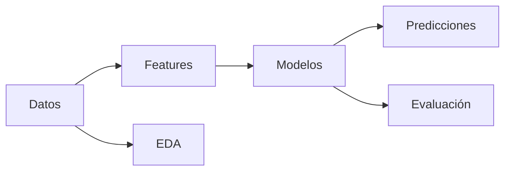

# Grafo de Conocimiento — {{ project_name }}

> Grafo generado automáticamente por graphify.
> Los nodos del grafo se representan como wikilinks de Obsidian.

## Mapa del grafo

```
(proyecto: {{ project_name }})
  ├── (datos) → [[02_DATOS/fuentes|Fuentes]] · [[02_DATOS/features|Features]]
  ├── (modelos) → [[01_PROYECTO/modelos|Modelos]]
  ├── (agentes) → [[05_AGENTES/_index|Agentes]]
  │     ├── [[05_AGENTES/DataAgent|Data Agent]]
  │     ├── [[05_AGENTES/MLAgent|ML Agent]]
  │     ├── [[05_AGENTES/TestAgent|Test Agent]]
  │     └── ...
  └── (meta) → [[00_META/IA_index|Índice IA]]
```

## Nodos detectados


```dataview
TABLE file.tags as Tags, created as Created
FROM "05_AGENTES"
SORT file.name ASC
```


## Relaciones




