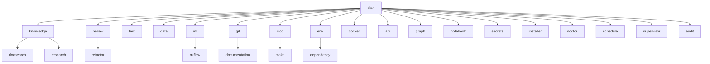

# Directorio de Agentes — {{ project_name }}

> Este índice es el punto de entrada para navegar las fichas de agentes del proyecto.
> Cada ficha detalla el rol, capacidades, límites y recursos del agente,
> extraídos de `agents/contracts.py`.

## Agentes de coordinación

| Agente | Rol | Archivo |
|--------|-----|---------|
| [[05_AGENTES/PlanAgent\|Plan Agent]] | Jefe de proyecto: descompone encargos y delega | `agents/agents/plan_agent.py` |
| [[05_AGENTES/SupervisorAgent\|Supervisor Agent]] | Coordina workers en competencia | `agents/agents/supervisor_agent.py` |
| [[05_AGENTES/AuditAgent\|Audit Agent]] | Auditor del equipo | `agents/agents/audit_agent.py` |

## Agentes de conocimiento

| Agente | Rol | Archivo |
|--------|-----|---------|
| [[05_AGENTES/KnowledgeAgent\|Knowledge Agent]] | Dueño del grafo de conocimiento y vault Obsidian | `agents/agents/knowledge_agent.py` |
| [[05_AGENTES/DocsearchAgent\|Docsearch Agent]] | Buscador del grafo de conocimiento | `agents/agents/docsearch_agent.py` |
| [[05_AGENTES/ResearchAgent\|Research Agent]] | Investigador externo (arXiv/OpenAlex) | `agents/agents/research_agent.py` |

## Agentes de código y calidad

| Agente | Rol | Archivo |
|--------|-----|---------|
| [[05_AGENTES/ReviewAgent\|Review Agent]] | Revisor de código (solo lectura) | `agents/agents/review_agent.py` |
| [[05_AGENTES/RefactorAgent\|Refactor Agent]] | Único que modifica código fuente | `agents/agents/refactor_agent.py` |
| [[05_AGENTES/TestAgent\|Test Agent]] | Ejecuta la suite de tests | `agents/agents/test_agent.py` |

## Agentes de datos y ML

| Agente | Rol | Archivo |
|--------|-----|---------|
| [[05_AGENTES/DataAgent\|Data Agent]] | Analista de datos — EDA y calidad | `agents/agents/data_agent.py` |
| [[05_AGENTES/MLAgent\|ML Agent]] | Analista de modelos entrenados | `agents/agents/ml_agent.py` |
| [[05_AGENTES/MLflowAgent\|MLflow Agent]] | Consulta tracking de experimentos | `agents/agents/mlflow_agent.py` |
| [[05_AGENTES/GraphAgent\|Graph Agent]] | Auditor de figuras | `agents/agents/graph_agent.py` |
| [[05_AGENTES/NotebookAgent\|Notebook Agent]] | Único que toca notebooks | `agents/agents/notebook_agent.py` |

## Agentes de entrega y entorno

| Agente | Rol | Archivo |
|--------|-----|---------|
| [[05_AGENTES/GitAgent\|Git Agent]] | Único que escribe en git | `agents/agents/git_agent.py` |
| [[05_AGENTES/DocumentationAgent\|Documentation Agent]] | Dueño de la documentación | `agents/agents/documentation_agent.py` |
| [[05_AGENTES/CICDAgent\|CI/CD Agent]] | Dueño de workflows CI/CD | `agents/agents/cicd_agent.py` |
| [[05_AGENTES/MakeAgent\|Make Agent]] | Dueño del Makefile | `agents/agents/make_agent.py` |
| [[05_AGENTES/EnvAgent\|Env Agent]] | Dueño del entorno Python | `agents/agents/env_agent.py` |
| [[05_AGENTES/DependencyAgent\|Dependency Agent]] | Vigilante de dependencias | `agents/agents/dependency_agent.py` |
| [[05_AGENTES/DockerAgent\|Docker Agent]] | Revisor de Docker | `agents/agents/docker_agent.py` |
| [[05_AGENTES/APIAgent\|API Agent]] | Revisor de API FastAPI | `agents/agents/api_agent.py` |
| [[05_AGENTES/SecretsAgent\|Secrets Agent]] | Escáner de secretos | `agents/agents/secrets_agent.py` |
| [[05_AGENTES/InstallerAgent\|Installer Agent]] | Dueño de agents/external/ | `agents/agents/installer_agent.py` |
| [[05_AGENTES/DoctorAgent\|Doctor Agent]] | Diagnóstico integral | `agents/agents/doctor_agent.py` |
| [[05_AGENTES/ScheduleAgent\|Schedule Agent]] | Experto en cron | `agents/agents/schedule_agent.py` |
